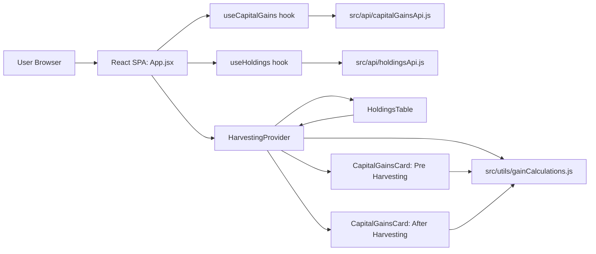
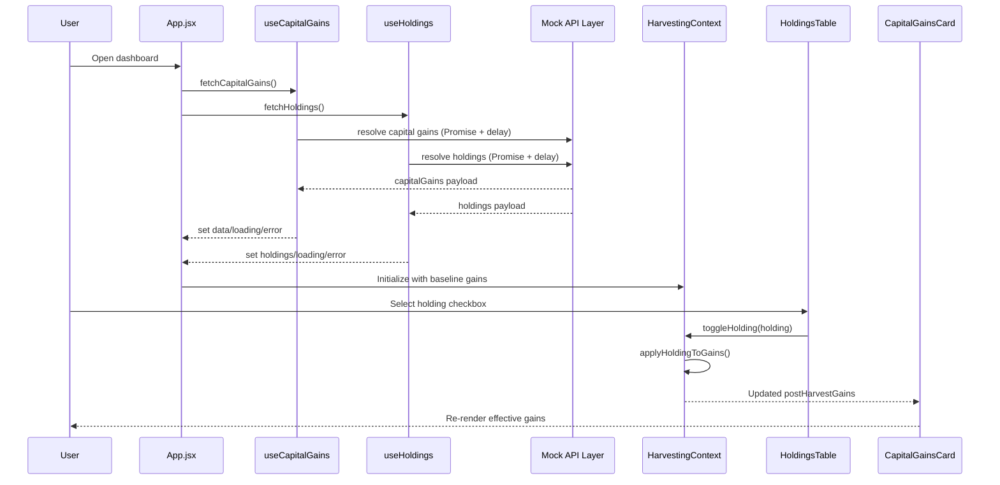
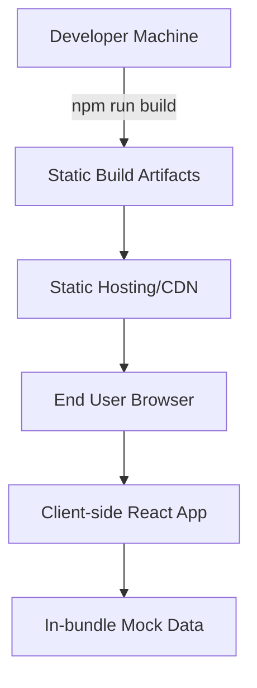

# Tax Loss Harvesting

A React-based tax-loss harvesting simulation dashboard that lets users compare pre-harvest and post-harvest capital gains by selecting holdings in a portfolio table. The app is currently frontend-only and uses in-memory mock datasets to emulate API responses while providing a production-style UI flow for gain/loss analysis.

## Key Features

- Pre-harvest vs after-harvest capital gains comparison (STCG/LTCG).
- Interactive holdings table with row and bulk selection.
- Real-time recomputation of post-harvest gains using shared context state.
- Responsive light/dark UI variants with mobile-optimized layout.
- Simulated API latency for realistic loading states and skeletons.

## Target Users & Use Cases

- Retail crypto investors evaluating tax-loss harvesting scenarios.
- Product teams prototyping portfolio tax workflows before backend integration.
- Frontend engineers building/demoing financial analytics interfaces.

## Table of Contents

- [Project Overview](#project-overview)
- [System Architecture](#system-architecture)
  - [High-Level Architecture](#high-level-architecture)
  - [Module Breakdown](#module-breakdown)
  - [Component Communication](#component-communication)
  - [System Architecture Diagram](#system-architecture-diagram)
  - [Service Interaction Diagram](#service-interaction-diagram)
  - [Deployment Architecture](#deployment-architecture)
- [Tech Stack](#tech-stack)
- [Project Structure](#project-structure)
- [Data Contracts](#data-contracts)
- [API Surface](#api-surface)
- [State Management & Business Logic](#state-management--business-logic)
- [Configuration](#configuration)
- [Getting Started](#getting-started)
- [Available Scripts](#available-scripts)
- [Build & Deployment](#build--deployment)
- [Operational Notes](#operational-notes)
- [Known Gaps & Next Steps](#known-gaps--next-steps)
- [Contributing](#contributing)

## Project Overview

**Project name:** `tax-loss-harvesting`

This project visualizes tax-loss harvesting outcomes by combining baseline capital gains with selected holdings and recalculating the resulting gain/loss totals. It is designed as a UI-first architecture: hooks load data, a context layer manages selection state and derived gains, and presentational components render cards/tables. The current implementation is intentionally backend-agnostic and uses local mock data to support rapid UI iteration.

## System Architecture

### High-Level Architecture

The application is a client-rendered React SPA (Create React App runtime). Data loading happens through hook abstractions (`useCapitalGains`, `useHoldings`) that call local API adapters under `src/api`. Portfolio selection and post-harvest recalculation are centralized in `HarvestingContext`, then consumed by cards and table components.

### Module Breakdown

- **App Shell (`src/App.jsx`)**: page composition, theme toggle, loading/error orchestration.
- **Data Access (`src/api/*`)**: mock async API providers with fixed datasets.
- **Hooks (`src/hooks/*`)**: fetch lifecycle state (`loading`, `error`, data normalization/sorting).
- **State Layer (`src/context/HarvestingContext.jsx`)**: selected assets + derived post-harvest gains.
- **Domain Utilities (`src/utils/gainCalculations.js`)**: net gain math and formatting helpers.
- **UI Components (`src/components/*`)**: capital gain cards, holdings table, savings banner, skeleton loaders.

### Component Communication

1. `App` invokes data hooks to load capital gains and holdings.
2. `HarvestingProvider` is initialized with baseline gains.
3. `HoldingsTable` triggers `toggleHolding` / `toggleAll` from context.
4. Context applies `applyHoldingToGains` and recalculates derived gains.
5. `CapitalGainsCard` re-renders with updated `postHarvestGains`.

### System Architecture Diagram



### Service Interaction Diagram



### Deployment Architecture



## Tech Stack

| Layer | Technology | Purpose |
| --- | --- | --- |
| Frontend | React 18, ReactDOM 18, CSS | SPA UI rendering, stateful interactions, responsive styling |
| Backend | N/A | No backend service in this repository |
| Database | N/A | No persisted datastore; data is in static JS objects |
| Infrastructure | Static asset hosting (any CDN/web server) | Serve CRA build output (`build/`) |
| DevOps | npm scripts (`start`, `build`), Create React App tooling | Local development server and production bundling |
| Authentication | N/A | No auth flow implemented |
| Messaging / Queues | N/A | No async messaging system implemented |

## Project Structure

```text
tax-loss-harvesting/
├── public/
│   ├── index.html                  # HTML shell for React mount point
│   └── logo.svg                    # Brand asset used in navbar
├── src/
│   ├── api/
│   │   ├── capitalGainsApi.js      # Mock capital gains API
│   │   └── holdingsApi.js          # Mock holdings API
│   ├── components/
│   │   ├── CapitalGainsCard/
│   │   │   ├── index.jsx           # Gain cards (pre/post harvesting)
│   │   │   └── CapitalGainsCard.css
│   │   ├── HoldingsTable/
│   │   │   ├── index.jsx           # Selectable holdings table
│   │   │   └── HoldingsTable.css
│   │   ├── Loader/
│   │   │   └── index.jsx           # Skeleton loading components
│   │   └── SavingsBanner/
│   │       └── index.jsx           # Post-harvest savings callout
│   ├── context/
│   │   └── HarvestingContext.jsx   # Global selection + derived gains state
│   ├── hooks/
│   │   ├── useCapitalGains.js      # Capital gains fetch hook
│   │   └── useHoldings.js          # Holdings fetch + sorting hook
│   ├── utils/
│   │   └── gainCalculations.js     # Domain calculations and formatters
│   ├── App.jsx                     # Root page composition
│   ├── App.css                     # Global/theme styles
│   └── index.js                    # React app bootstrap
├── package.json                    # Dependencies and scripts
├── package-lock.json               # npm lockfile (present in working tree)
└── README.md
```

## Data Contracts

### Capital Gains

```ts
type CapitalGains = {
  stcg: { profits: number; losses: number }
  ltcg: { profits: number; losses: number }
}
```

### Holding

```ts
type Holding = {
  coin: string
  coinName: string
  logo: string
  currentPrice: number
  totalHolding: number
  averageBuyPrice: number
  stcg: { balance: number; gain: number }
  ltcg: { balance: number; gain: number }
}
```

## API Surface

There are no HTTP routes in this repository yet. Data is provided through local async adapters:

- `fetchCapitalGains()` → resolves `{ capitalGains }` after simulated latency.
- `fetchHoldings()` → resolves `Holding[]` after simulated latency.

These can be replaced later with real REST/GraphQL calls without changing consuming components.

## State Management & Business Logic

- `selectedCoins: Set<string>` tracks selected holdings.
- `postHarvestGains` is derived by applying selected holding gains/losses to baseline gains.
- `toggleHolding` handles row-level selection.
- `toggleAll` handles table-level bulk select.
- `applyHoldingToGains` applies STCG/LTCG deltas with sign handling.

## Configuration

### Environment Variables

No project-specific environment variables are required today.

### Not Found in Repository

- No Dockerfile / docker-compose.
- No CI/CD pipeline config.
- No backend service or database migration files.
- No infrastructure-as-code manifests.

## Getting Started

### Prerequisites

- Node.js 18+ recommended
- npm 9+

### Install

```bash
npm install
```

### Run Development Server

```bash
npm start
```

The app is served by CRA dev server (typically `http://localhost:3000`).

## Available Scripts

| Script | Command | Description |
| --- | --- | --- |
| Start | `npm start` | Launch development server with hot reload |
| Build | `npm run build` | Create optimized static production build in `build/` |

## Build & Deployment

1. Build:

```bash
npm run build
```

2. Deploy the generated `build/` folder to any static host (Nginx, S3+CloudFront, Netlify, Vercel static output, etc.).

3. Optional local static check:

```bash
npx serve -s build
```

## Operational Notes

- Data is mock/in-memory and resets on refresh.
- Selection state is session-local (not persisted).
- Hooks include basic error handling but no retry/backoff.
- Holdings are sorted by absolute total gain magnitude in `useHoldings`.

## Known Gaps & Next Steps

- Replace mock API modules with real backend integration.
- Add unit/integration tests for calculator logic and context state transitions.
- Add linting/formatting/test scripts (`eslint`, `prettier`, `jest`).
- Add accessibility test coverage and keyboard interaction checks.
- Add typed contracts (TypeScript or runtime schema validation).
- Fix encoding issue in `formatINR` where rupee symbol appears malformed in source.

## Contributing

1. Create a feature branch.
2. Keep changes focused and documented.
3. Run `npm run build` before opening a PR.
4. Include screenshots for UI-impacting changes (desktop + mobile + dark/light modes).
